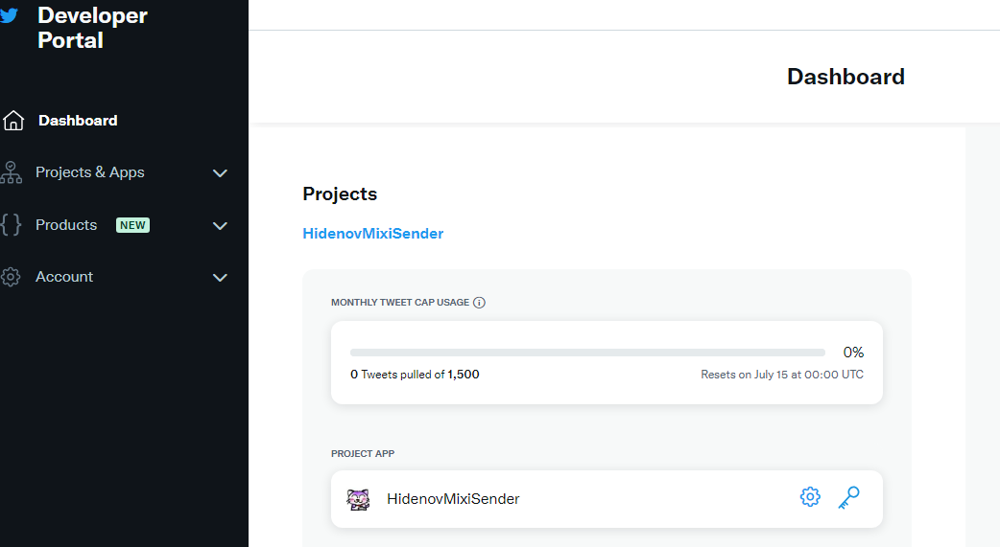

# HidenovMixiSender
mixi のつぶやきに投稿した内容を　Twitter に転送する GAS( Google Apps Script ) アプリです。

- イーロン兄貴が Twitter API を無料ではまともに使えなくしたことに伴い、Twitter→mixi へつぶやきを転送するのはとてもカネがかかるようになりました。
- なので mixi が Twiiter のつぶやきを mixi に転送するサービスを止めてしまったことはしかたがないです．．．
- カネが無いのはイーロン兄貴も mixi もひでのふも皆同じ。よってこの仕組みは無料で実現できています。
- そうは言ってもハードルは結構高いです！覚悟は良いか！

## 使い方
### 準備するもの
- 有効なクレジットカード（ 2023.6.20 現在課金は行われていない ）
- Docomo、AU、Softbank 何れかのキャリアが提供している MMS のメールアドレス
- Google Drive / GMail のアカウント
- mixi のアカウント
- Twitter のアカウント
### 大雑把な準備の手順
1. mixi Platform 利用登録を行う。
  下記の Partner Dashboard が表示できるようになればＯＫです。

2. Twitter の Developer Portal に登録を行う。
　下記の Developer Portal が表示できるようになればＯＫです。

3. GAS のプロジェクトが作れるようになる。
  下記の Apps Script のコンソールが表示できるようになればＯＫです。

4. GitHub のこのリポジトリからソースコードをダウンロードする。
  下記の５つのファイルをダウンロードしてください。
   - 
HidenovMixiSender.gs

   - 
HidenovMixiSenderAuth.gs

   - 
HidenovMixiSenderRedirect.gs

   - 
HidenovTwitterAuth.gs

   - 
config.json.org

5. GDrive のマイドライブの下に、HidenovMixiSender のフォルダを作る。
6. 手順 5. で作成したフォルダのアドレスバーから、folder/ 以降の文字列を　folder_id としてメモする。
 
7. 
手順 5. で作成したフォルダに、手順 4.でダウンロードした config.json.org をアップロードする。

8.  
config.json.org をコピーし、config.json にリネームする。

9. 手順 5. で作成したフォルダで、Google Apps Script のプロジェクトを新しく作る。
  
10.  
スクリプト名を HidenovMixiSender 変更し、手順 4.でダウンロードした HidenovMixiSender.gs の内容をコピペする。
 
11. スクリプトプロパティに folder_id を作成し、値に手順 6. でメモした folder_id を転記する。
12. プロジェクトを新しく Web アプリとしてデプロイする。デプロイした Web アプリの URL はメモしておく。
13.  手順 9. ～ 12. を他の３つの .gs ファイルに対しても同様に実行する。
14.  
Mixi の Partner Dashboard から新規サービスを追加する。この時、リダイレクト URL には手順 13. でメモした HidenovMixiSenderRedirect.gs の Web アプリの URL を設定する。

15.  
Twitter の Delevper Portal から新しいアプリを作成する。この時、
     - App psermissions は　Read and Write を選ぶ
     - Type of App は Web App, Automated App or Bot を選ぶ
     - App info の Callback URI / Redirect URL は下記の要領で設定する。
  
https://script.google.com/macros/d/ ここにIDを入れる /usercallback

  ID は HidenovTwitterAuth の projects/ から /edit までの間の文字列を入れる

  

16.  
config.json.org にクレデンシャル情報を記載する。

### 大雑把な使い方
1. デプロイした HidenovTwitterAuth の URL を開く。
2. 上手く行けば URL が二つ表示されるので、それぞれ別窓で開いて Twitter の承認処理を行う。
3. デプロイした HidenovMixiAuth の URL を開く。
4. 上手く行けば URL が表示されるので、別窓で開いて Mixi の承認処理を行う。
5. HidenovMixiSender のプロジェクトからトリガーを設定する。
     - 実行する関数は main
     - デプロイ時に実行は head
     - イベントのソースは 時間主導型
     - トリガーのタイプは 分ベースのタイマー
     - 時間間隔は５分。１分にするのはちょっとお勧めしない．．．

  
