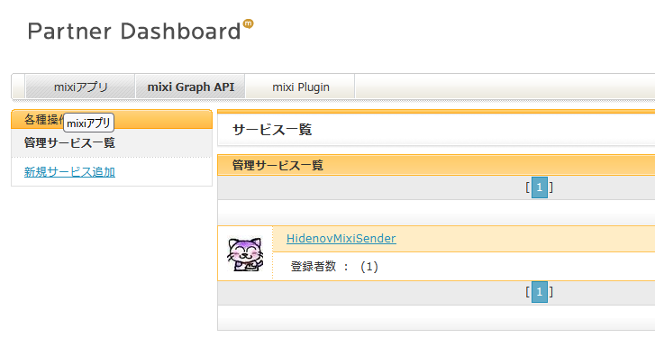

# mixi 新規サービス追加方法
### 前提条件
 - mixi Platform 利用登録が完了していること。
 - 全ての Google App Script 対し手順 12. まで完了していること。
 - HidenovMixiSenderRedirect がデプロイされていて、Web アプリの URL があること。
### 手順
 - 任意のブラウザで [mixi Platform](https://developer.mixi.co.jp/) のトップページを開く。
 - Partner Dashboard を開く。
 - メニューバーの「mixiGraphAPI」をクリックする。

 - 「新規サービス追加」をクリックし、下記の要領で登録する。
  → 「サービス名」は任意のわかりやすい文字列を入力。
  → 「ロゴ」は任意の .jpg ファイルでＯＫ。
  → 「サービス説明」は任意のわかりやすい内容を入力。
  → 「リダイレクトURL」は HidenovMixiSenderRedirect の Web アプリの URL を入力。
  → 「お問い合わせ用メールアドレス」はちゃんと届くメールアドレス。キャリアのメールアドレスでなくてもＯＫ。
  → 「利用規約」の同意するにチェックを入れて「確認」をクリック。
 - お問い合わせ用メールアドレスに認証用のメールが届くので、リンクをクリックして登録を完了させる。
 - 「管理サービス一覧」から登録したサービスが確認できるのでクリックする。
 - Consumer Key と Consumer Secret が発行されていればこの手順は完了です！

