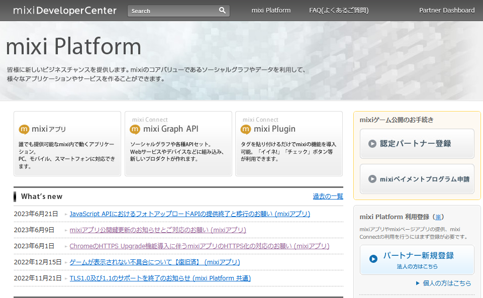
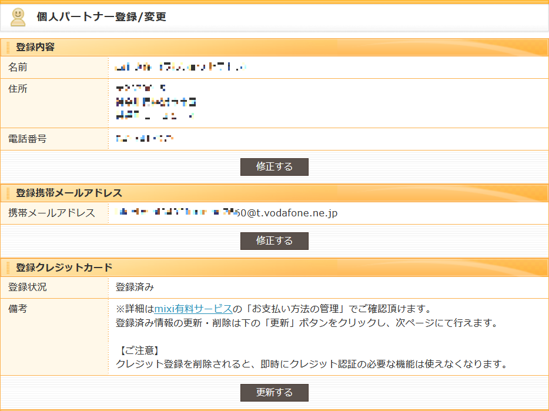

# mixi Platform 利用登録方法
### 必要なもの
 - mixi のアカウント
 - キャリア（ Docomo, AU, Softbank, 楽天 ）が提供しているメールアドレス。
 - 有効なクレジットカード（2023.07.08 現在 mixi から課金は行われていない）
### 手順
 - 任意のブラウザで [mixi Platform](https://developer.mixi.co.jp/) のトップページを開く。

 - 右下の「個人の方はこちら」リンクを開く。
 - mixi にログインしていなければ、mixi へのログインを要求されるので、ログインする。
 - 「個人パートナー登録」をするボタンを押す。
 - 再度パスワードを要求されるので、mixi ログイン時に使用しているパスワードを入力する。
 - 個人パートナーの登録画面で個人情報を入力し、登録する。
 - 下記の画面から、携帯メールアドレスと、クレジットカードを登録する。

 - 携帯メールアドレスに認証用のメールが届くので、リンクをクリックして登録を完了させる。

