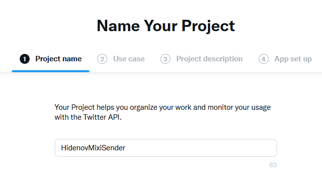

# Twitter アプリ追加方法
### 前提条件
 - Twitter 開発者プラットフォーム利用登録が完了していること。
 - 全ての Google App Script 対し手順 12. まで完了していること。
 - HidenovTwitterAuth がデプロイされていて、Web アプリの URL があること。
### 手順
 - 任意のブラウザで Twitter にログインしておく。
 - 同じブラウザで [Twitter 開発者プラットフォーム](https://developer.twitter.com/ja) のトップページを開く。
 - Developer Dashboard を開く。

 - 「Create Project」をクリックする。
 - プロジェクト名を入力して「Next」

 - アプリの構築目的で「Building consumer tools(hobbyist)」を選択して「Next」

 - プロジェクトの説明を入力する。Twitter 開発者プラットフォーム利用登録と同じ文面で良いと思います。

- アプリの名前を入力して「Next」。
  プロジェクト名と同じで良いと思いますが、**既に他のアプリで使われている名前は使えません！**。
- API Key、API Key Secret、Bealer Token が表示されるのでメモる。**この時しか表示されないので必ずメモる**。
- 左ペインからアプリを選択し「User authentication settings」の「Setup」をクリック。

- 下記の要領で登録し「Save」をクリック。

  
  → App permissions は　Read and Write を選ぶ
  → Type of App は Web App, Automated App or Bot を選ぶ 
  → App info の Callback URI / Redirect URL は下記の要領で設定する。
https://script.google.com/macros/d/ ここにIDを入れる /usercallback