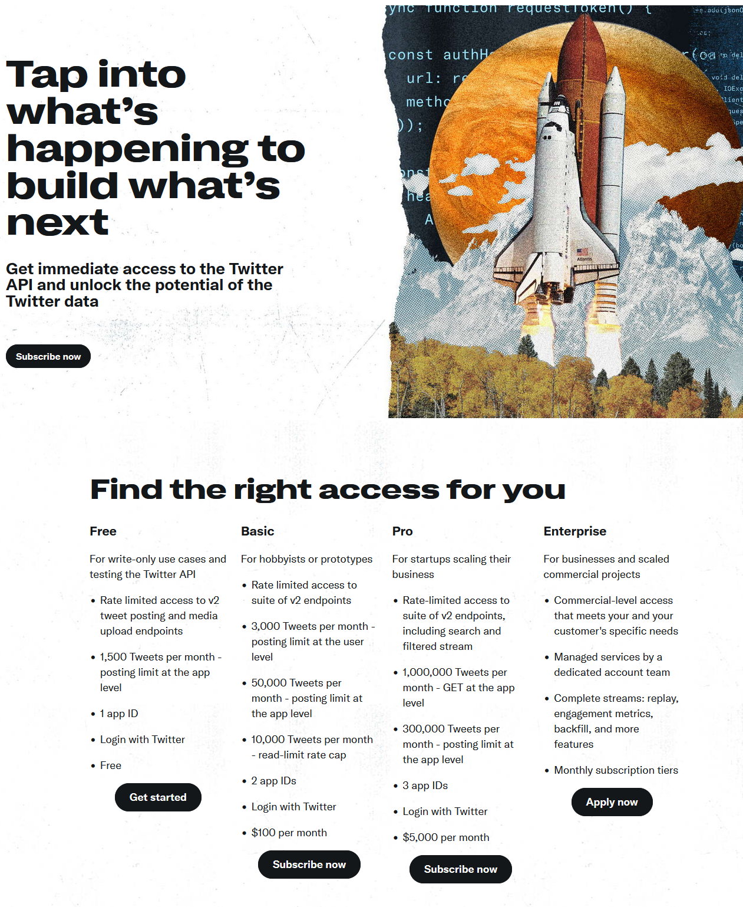
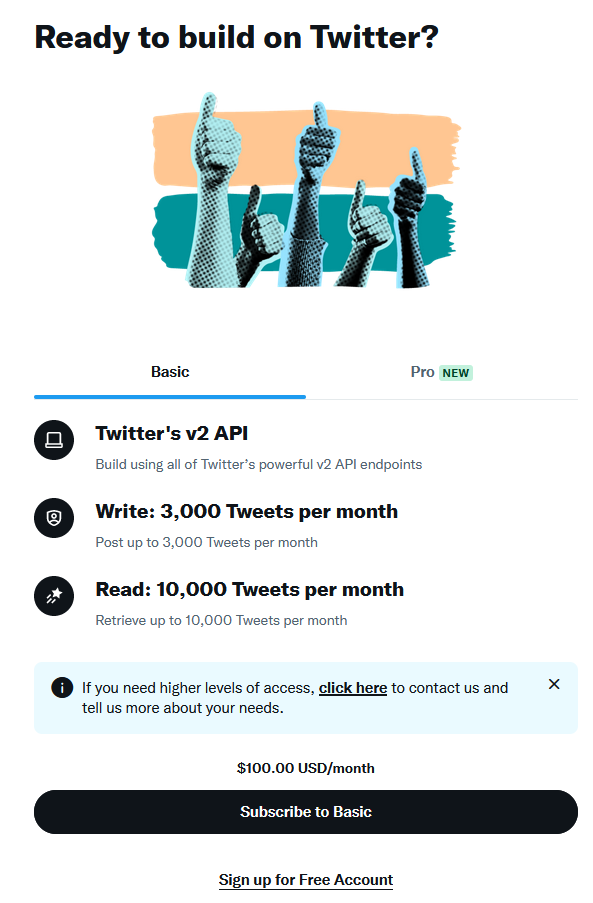
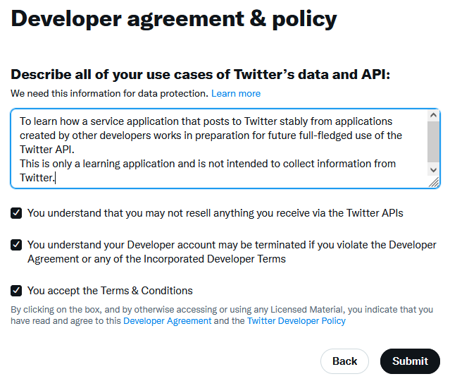
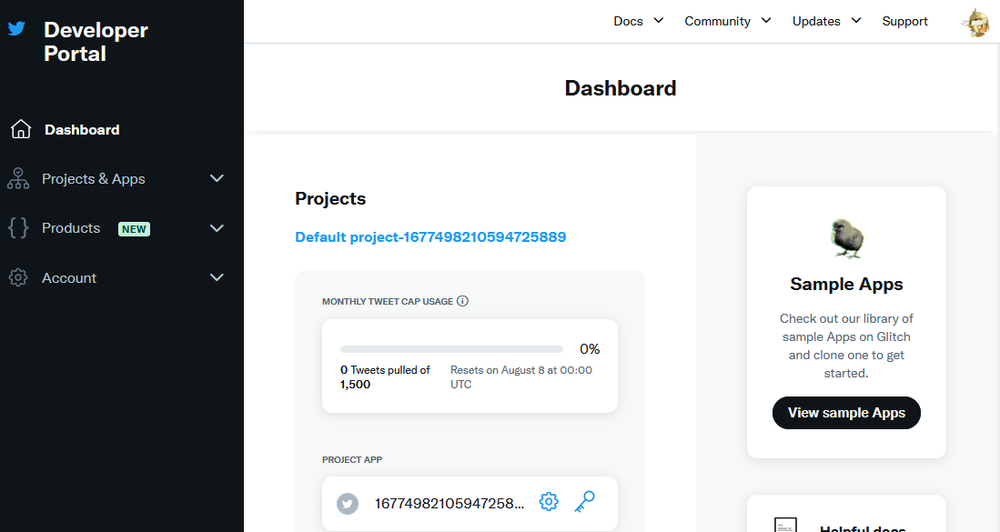
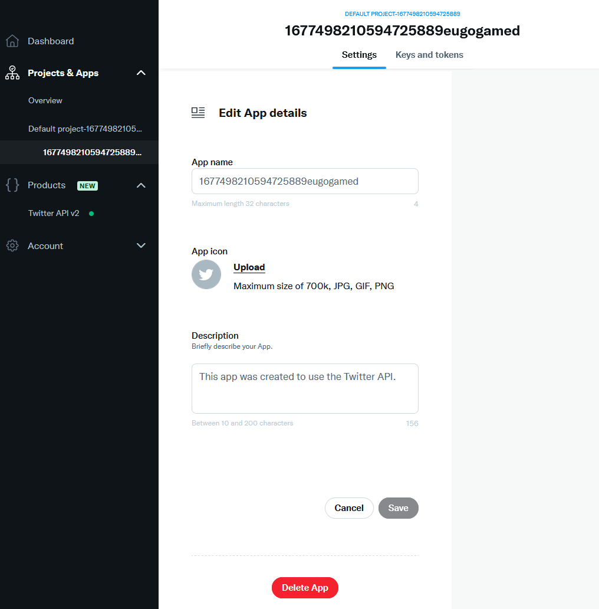
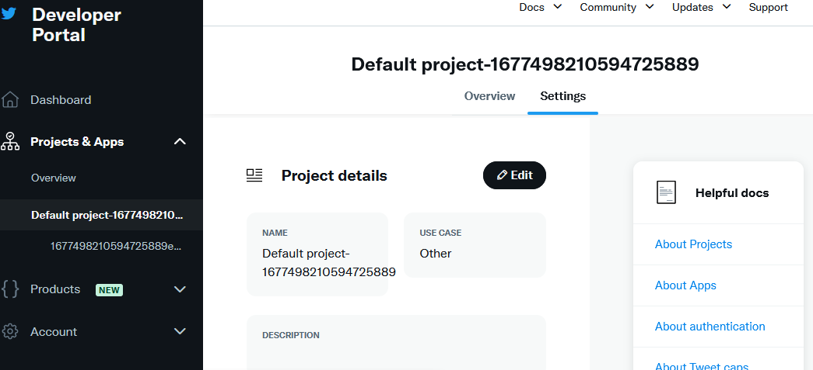

# Twitter 開発者プラットフォーム利用登録方法
### 必要なもの
 - Twitter のアカウント
### 手順
 - 任意のブラウザで Twitter にログインしておく。
 - 同じブラウザで [Twitter 開発者プラットフォーム](https://developer.twitter.com/ja) のトップページを開く。
 - 画面左側の「Free」の下にある「Get Started」をクリックする。

 - 画面下の「Sign up for Free Account」をクリックする。
  

 - 「Developer agreement & policy」に下記の要領で入力する。

 - 250 文字とそこそこ長い文章を要求されるので、下記の内容を翻訳して利用して水増しすると良いかと。
  「これはあくまでも学習用のアプリケーションであり、Twitterからの情報収集は目的としていない。」
  「今後の Twitter API を本格的に利用する場合に備えて Free Tier での初歩的な確認を目的としています。」
  「他の開発者が作成した Twitter API を利用したアプリケーションを試すことを目的としています。」

 - Developer Portal が開かれる。開かれない場合は [Twitter 開発者プラットフォーム](https://developer.twitter.com/ja) のトップページからDeveloper Portalを開く。
  

 - デフォルトで登録されているアプリを削除する。左側のペインからデフォルトのアプリを開き、下記の設定画面を表示する。

  
 - 「Settings」→「Delete App」でデフォルトのアプリを削除する。
 - デフォルトで登録されているプロジェクトを削除する。

 - 同様に「Edit」→「Delete Project」で削除する。

